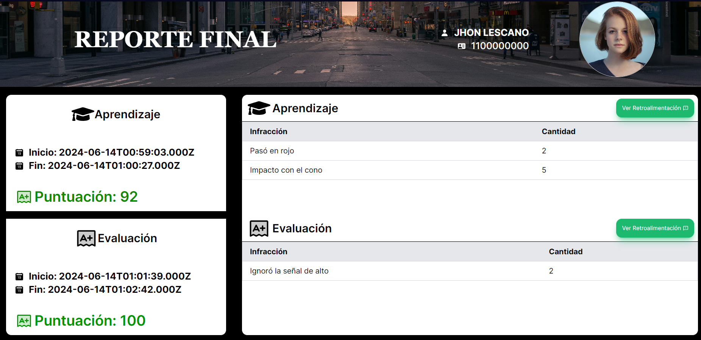
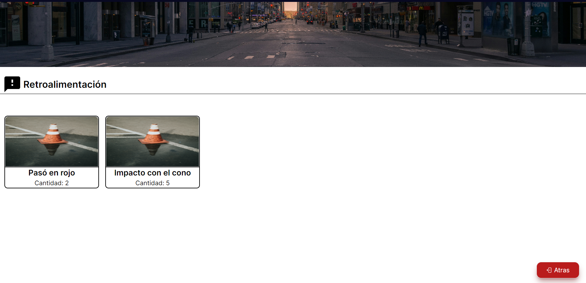

  

# SimDrive

SimDrive is a didactic immersive learning experience with traffic rules in virtual worlds. 

## Tech Stack

**Client:** Next.js, HTML, TailwindCSS, CSS

## Features

- Landing Page
- Login
- Report
- Feedback

## Screenshots

### Virtual World

### Landing Page

### Report

### Feedback

## Info

This project aims to identify people's ability to learn traffic signs and apply what they have learned in a safe virtual environment, where their knowledge is effectively evaluated.

#### Project Status
Currently, the project is in the implementation phase and we are performing tests to ensure its correct operation.

#### Frontend Repository
This repository contains exclusively the frontend web application. Here you will find the user interface code.

#### Tech 
**Virtual Environment**: We used OpenSim to create the interactive virtual environment (not included in this repository).

**Database:** We use MySQL as our database. (not included in this repository).

**Backend**: To connect the database to the virtual environment, PHP was used. (not included in this repository).

**Backend - Web application**: The connection between the database and the frontend - web application has been implemented with Node.js with the Express framework.

## Authors

- [@Christian Chico](https://www.github.com/ChristianCLop)
- [@Enrique Ortiz](https://github.com/EnriqueOrtiz2001)
- [@Marlon Copara](https://github.com/MarlonCopara)

## SimDrive

We will keep you updated with our progress and future projects. 

